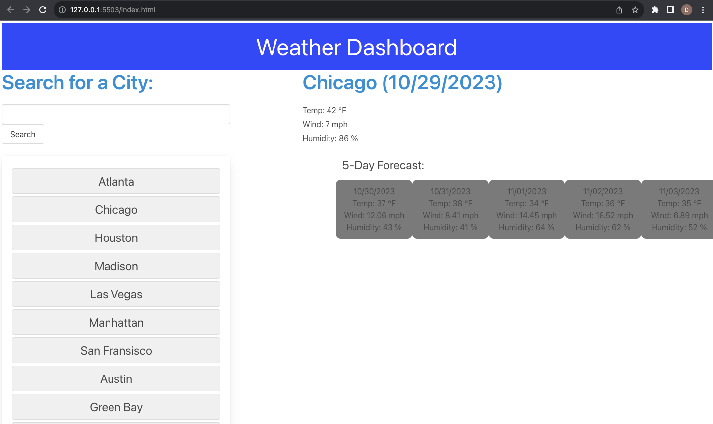

# Weather-Dashboard

# Description
This weather-dashboard app serves the purpose for users to be able to display weather conditions for any city of their choosing. Temperature, wind-speed, humidity, and date will be what the user is shown.
Overall, the tasks for this assignment helped my understanding for how to implement third-party APIs.

# Usage 

- users enter a city name inside the search bar
- once entered, weather conditions of the present and the future will be displayed
- in the large block will be information regarding the present
- the smaller boxes will contain the forecast for the next 5 days

# Screenshot

  

# Credits
https://www.youtube.com/watch?v=MIYQR-Ybrn4

